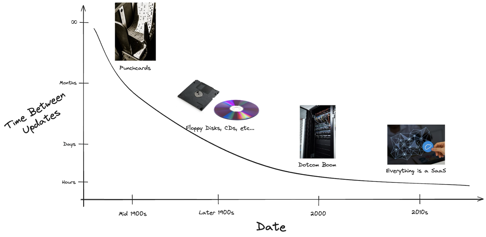
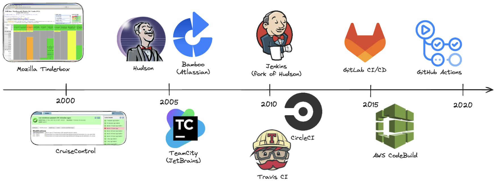

# 01. History and Motivation

Continuous Integration (CI) has dramatically transformed the way we build, test, and deliver software. What once took weeks or months is now handled in minutes — all thanks to decades of innovation in tooling and process.

## Speed of Software Delivery over Time

The time between writing and shipping software has shrunk drastically over the decades:

| Era             | Delivery Method               | Turnaround Time        |
|------------------|-------------------------------|------------------------|
| 🧮 1960s–70s      | **Punch cards / Mainframes**    | Days to weeks          |
| 💾 1980s–90s      | **Floppy disks, CDs**          | Monthly to yearly      |
| 🌐 2000s          | **Server deployments**         | Weekly to quarterly    |
| ☁️ 2010s–Now      | **CI/CD pipelines & cloud**     | Multiple times per day |

## History of CI Systems

| Year | CI Tool           | Significance |
|------|-------------------|--------------|
| 1997 | **Tinderbox**     | Mozilla’s early build tracker – one of the first CI-like systems. |
| 2001 | **CruiseControl** | First widely adopted open-source CI server. |
| 2004 | **Hudson**        | Friendly UI and plugin support for Java CI; widely adopted. |
| 2006 | **TeamCity**      | JetBrains' commercial CI with strong IDE and test integration. |
| 2007 | **Bamboo**        | Atlassian's CI/CD tool with tight JIRA/Bitbucket integration. |
| 2011 | **Jenkins**       | Community-driven fork of Hudson; became CI standard for years. |
| 2011 | **Travis CI**     | First GitHub-native CI/CD as a service. |
| 2011 | **CircleCI**      | Cloud CI/CD with fast feedback and Docker-native builds. |
| 2015 | **GitLab CI/CD**  | Built-in CI/CD pipelines in GitLab, configured via YAML. |
| 2016 | **AWS CodeBuild** | Managed CI inside AWS ecosystem. |
| 2018 | **GitHub Actions**| GitHub-native automation with deep ecosystem and community support. |

