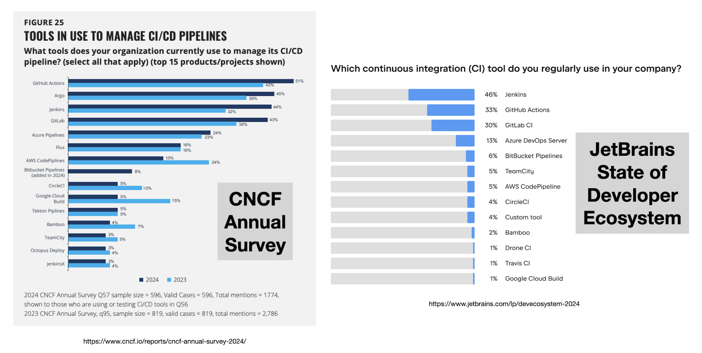

# 02. Why GitHub Actions

GitHub Actions is one of the most popular CI tools across the industry. Here is a comparison with some of the other top choices:

| Tool        | Why Yes?                                                                                                                                             | Why No?                                                                                                                |
|-------------|-------------------------------------------------------------------------------------------------------------------------------------------------------|------------------------------------------------------------------------------------------------------------------------|
| GitHub Actions | • Your code is (likely) on GitHub already    • Minimal barrier to entry   • Expansive public marketplace   • Market leadership leads to improved tooling (like [namespace.so](https://namespace.so)!) | • If you aren’t already using GitHub   • Less powerful pipeline reuse primitives   • Painful debugging experience   • Limited analytics/observability |
| GitLab CI   | • Your code (might be) on GitLab already   • Minimal barrier to entry (if using GitLab)   • Deep integration with other GitLab features   • GitLab “Auto DevOps” | • If you aren’t already using GitLab   • Smaller public marketplace (<500 total)                                       |
| CircleCI    | • Your code isn’t on GitHub or GitLab (CircleCI is VCS agnostic)   • Built-in “retry with SSH” feature is 🔥                                            | • Requires initial setup (vs. GHA + GitLab)   • Smaller public orbs marketplace (3653 total)                           |
| Jenkins     | • You (might) already be using it   • The plugin ecosystem is vast                                                                                      | • Incurs significant maintenance overhead (security and plugin dependencies)   • Groovy pipeline DSL feels outdated    |
