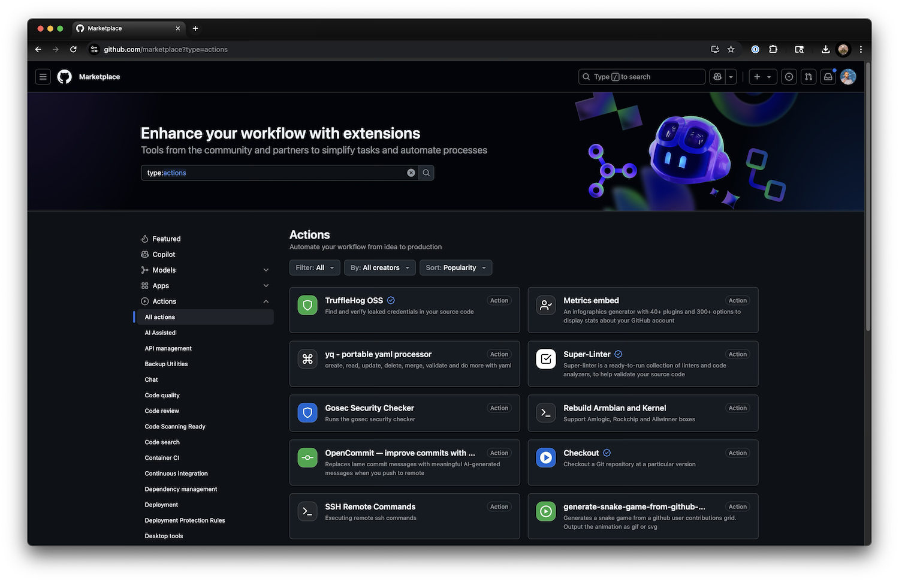

# 05. Marketplace Actions

The [GitHub Actions Marketplace](https://github.com/marketplace?type=actions) is one of the platforms best features. There are thousands of open source actions you can use to build your automation pipelines.




## Assessing Actions

Not all actions are created equal. You should review before use.

1. Assess like any open source dependency
2. Does it do what you need it to?
3. Signals for quality/trustworthiness:
    - User verification
    - Number of stars
    - Active commit history

## Security

Actions often run with access to sensitive data/environments

The only way to ensure you are running the same version is to pin with the commit hash:
```
❌ - uses: actions/checkout
❌ - uses: actions/checkout@v4
❌ - uses: actions/checkout@v4.2.2
✅ - uses: actions/checkout@11bd71901bbe5b1630ceea73d27597364c9af683 # v4.2.2
```

In 2025, a supply chain attack affected many repositories who did not follow this approach: https://www.wiz.io/blog/github-action-tj-actions-changed-files-supply-chain-attack-cve-2025-30066

## Popular Actions

### Official Actions (from GitHub)
- checkout https://github.com/marketplace/actions/checkout-action 
- cache https://github.com/marketplace/actions/cache 
- artifact
  - upload https://github.com/marketplace/actions/upload-a-build-artifact
  - download https://github.com/marketplace/actions/download-a-build-artifact
- github-script https://github.com/marketplace/actions/github-script

### Install Runtimes / Dependencies (e.g. node)
- setup-node https://github.com/marketplace/actions/setup-node-js-environment
- setup-go https://github.com/marketplace/actions/setup-go-environment
- setup-java-jdk https://github.com/marketplace/actions/setup-java-jdk

### Auth to 3rd External Application / Platform
- AWS https://github.com/marketplace/actions/configure-aws-credentials-action-for-github-actions
- Azure https://github.com/marketplace/actions/azure-login
- GCP https://github.com/marketplace/actions/authenticate-to-google-cloud

### Other
- Super-linter https://github.com/marketplace/actions/super-linter
- Build / push container images: https://github.com/marketplace/actions/build-and-push-docker-images
