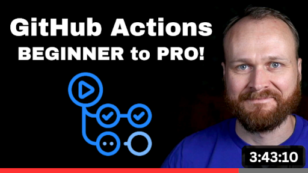
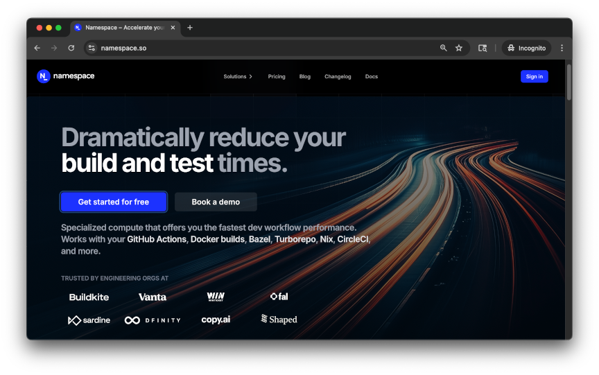

# DevOps Directive GitHub Actions Course

This is the companion repo to: [GitHub Actions: Beginner to Pro](https://courses.devopsdirective.com/github-actions-beginner-to-pro)

[](https://youtu.be/Xwpi0ITkL3U)

## 🙌 Sponsored by Namespace Labs

This course is made possible thanks to [namespace.so](https://namespace.so/?utm_source=devopsdirective), the best way level up your software build and developer workflows!


[](https://namespace.so/?utm_source=devopsdirective)

- **Faster GitHub Actions:** Hosted GHA runners for faster runs at a fraction of the cost!
- **Faster Docker Builds:** Remote Docker builders for massive container build speedups!
- **Continuous Integration Visibility:** Clear metrics and analytics to enable further CI optimization!

## 📚 Course Outline
- **History & Motivation:** why pipeline automation matters and the deployment metrics it influences.
- **Why GitHub Actions?:** managed runners, marketplace, and comparisons with other CI/CD tools.
- **Core Features:** workflows, jobs, steps, events, expressions, and secrets.
- **Advanced Features:** permissions, third-party authentication, caching, artifacts, and runner options.
- **Marketplace Actions:** discover and safely consume community actions.
- **Authoring Actions:** composite, reusable, JavaScript, and container actions.
- **Common Workflows:** validate, build, deploy, and automate your repository.
- **Developer Experience:** run locally with act, debug runs, and gather insights.
- **Best Practices:** performance tuning, maintainability, and security.
- **Capstone Project:** apply everything in a hands-on final exercise.

## Development Environment Setup

1. **Clone this repository (including submodules)**  
```bash
git clone --recurse-submodules git@github.com:sidpalas/devops-directive-github-actions-course.git
```

2. **Install DevBox** – DevBox bootstraps all required CLI tools (Go, Node.js, Python, `act`, `task`, `npc`, `civo`, `gh`, `jq`, `yq`, `kubectl`, `kluctl`, ...).  
   Follow the official installation guide: <https://www.jetify.com/docs/devbox/installing-devbox/index#>
   
   After installing devbox, run `devbox shell` to start a shell session with these tools installed/configured.

3. **Install Docker Desktop**  
   Download and install from: <https://docs.docker.com/get-started/introduction/get-docker-desktop/>

4. **Configure VS Code**

      a. **YAML** YAML syntax highlighting & linting

      b. **GitHub Actions** (optional): Workflow file syntax highlighting & snippets

> [!WARNING] 
> The GitHub Actions extension modifies the "file type" of wiles within /.github/workflows/ causing the YAML extension to not recognize those files.
> To fix this, you can add an explicit `files.associations` entry to your settings
> 
> ```json
> {
>   "files.associations": {
>     "**/.github/workflows/*.{yml,yaml}": "yaml",
>     "**/Taskfile.{yml,yaml}": "yaml"
>   }
> }
> ```
      
